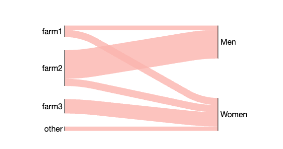
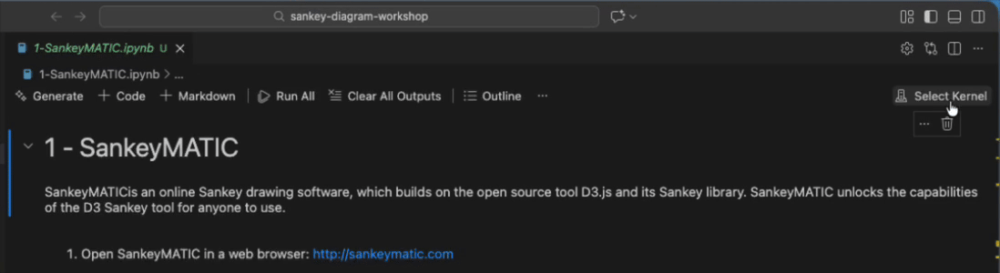

<!--
SPDX-FileCopyrightText: 2026 Bryn Pickering <bp325@cam.ac.uk>

SPDX-License-Identifier: MIT
-->

# ETB4 workshop - Drawing Sankey Diagrams

This workshop is broken down into 3 parts to get you familiar with building Sankey diagrams:

- [Part 1 - Using the SankeyMATIC online Sankey tool](./tutorials/1-SankeyMATIC.ipynb)
- [Part 2 - `floweaver` tutorials for Sankeys in Python](./tutorials/2-floweaver.ipynb)
- [Part 2a - `floweaver` advanced tutorials for Sankeys in Python](./tutorials/2a-floweaver-advanced.ipynb)
- [Part 3 - `plotly` tutorials for Sankeys in Python](./tutorials/3-plotly.ipynb)

All of these are given as Jupyter notebooks in the `tutorials` subdirectory.

Much of the content of this workshop is based on prior tutorials prepared by the [Resource Efficiency Collective](https://github.com/Resource-Efficiency-Collective).

## What is a Sankey diagram?

Sankey diagrams are a way to visualise flows between states in a system.
The width of the flows are proportional to the quantity flowing.
Often, these flows connect changes of state; each end of the flows indicate the initial (left) and final (right) state of flows.



## Prepare

First, you will need to install software on your device:

1. [VSCode](https://code.visualstudio.com/download).
This gives you access to an Interactive Development Environment (IDE) in which to edit code and to interact with your device's terminal.
On Windows, I recommend you follow the _command prompt_ instructions.
2. [pixi](https://pixi.sh/latest/).
This gives you access to `pixi` in your device's terminal, with which you can create isolated Python environments to work in.

> [!NOTE]
> **Why `pixi`?**
>
> Maybe you've already had experience with Python and used `pip` conda `environments` before.
> `pixi` is a next-generation package manager that makes things a lot more robust for project-specific Python environments.
> It is quicker, handles dependency resolution well and doesn't risk you adding random packages without a paper trail of those changes (you can run `pixi add ...` if you want to add a dependency that isn't available).
> You can still use `pip` and `conda` elsewhere but for the least friction possible in these workshop tutorials, use `pixi`.

### Set up VSCode

With this software installed, you can then set up your project:

1. Open VSCode.
1. Open a new terminal window (`Terminal` top-bar tab -> `New Terminal`, it will open at the bottom of the screen).

> [!NOTE]
> You will be using `pixi run` before every command you make in the terminal.
> This ensures you run your command in an isolated environment, giving you access to commands like `git` and `juputer notebook`.

### Clone the GitHub repository

With VSCode set up, you can "clone" (i.e. copy) this repository to your device:

1. In the VSCode terminal, call:

   ```sh
   git clone https://github.com/brynpickering/sankey-diagram-workshop.git <output-directory>/sankey-diagram-workshop
   ```

   `<output-directory>` should be a directory on your device where you want to store cloned GitHub repositories (often something like `%USERPROFILE%\Repositories` on Windows or `~/Repositories` on Linux/MacOS).

   > [!NOTE]
   > If it complains that it doesn't understand the command `git`, try running `pixi global install git` first.

1. Then you can open that cloned repository (i.e. downloaded folder) in VSCode (`File` top-bar tab -> `Open Folder` -> navigate to `<output-directory>/sankey-diagram-workshop`).

## Run a notebook

You can run your notebooks from inside VSCode.
First, **from inside your `<output-directory>/sankey-diagram-workshop` VSCode session**, install your working environment:

```sh
pixi install
```

Then, select a notebook in the file explorer and activate the kernel:



An alternative is to run it in a `jupyter notebook` session, e.g.:

```sh
pixi run jupyter notebook 1-SankeyMATIC.ipynb
```
